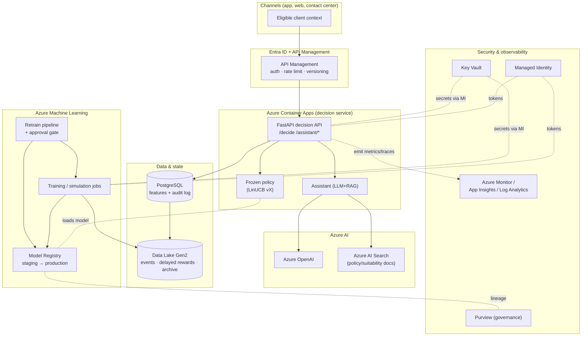

# Target architecture — Azure (Stage 6)

> 100% Azure mapping of the local demo. Nothing here is provisioned; it is the
> **target** design with trade-offs, a deploy plan, a qualitative FinOps estimate
> and a secrets/identity model (Key Vault + Managed Identity). No other cloud.

## 1. Component map (local → Azure)

| Concern | Local demo | Azure target | Why |
|---------|-----------|--------------|-----|
| Compute / API | FastAPI + Uvicorn | **Azure Container Apps** (ACA) | Serverless containers, scale-to-zero, revisions for policy versions; cheaper/simpler than AKS at this scale. |
| API gateway | — | **Azure API Management** (APIM) | Auth, rate limiting, quotas, request logging, versioned products. |
| Bandit training / experiments | local sim + MLflow file store | **Azure Machine Learning** (jobs + MLflow tracking + Model Registry) | Managed MLflow, run history, staging/production stages, approval gates. |
| Reward/feature data | Parquet under `data/` | **Azure Data Lake Storage Gen2** + **Delta**; serving features in **Azure Database for PostgreSQL** | Cheap versioned bulk storage; Postgres for low-latency reads + the audit log. |
| Decision/audit log | JSONL file | **PostgreSQL** table (+ Data Lake archive) | Queryable, retained, immutable append; archival to ADLS. |
| LLM | `LLMProvider` (mock/Anthropic) | **Azure OpenAI** (GPT-4o class) behind the same interface | One-line provider swap; data stays in-tenant. |
| RAG vector store | TF-IDF in-memory | **Azure AI Search** (vector + semantic) | Managed retrieval over synthetic policy docs; same `Retriever` contract. |
| Orchestration / retrain | `aep` CLI / Makefile | **Azure ML Pipelines** triggered by **Azure Data Factory** / schedule | Reproducible retrain with approval. |
| Observability | rich logs | **Azure Monitor + Application Insights + Log Analytics** | Traces, drift/reward dashboards, alerts. |
| Identity | — | **Microsoft Entra ID** + **Managed Identity** | No secrets in code; workload identity for service-to-service. |
| Secrets | `.env` (local only) | **Azure Key Vault** | API keys, connection strings; accessed via Managed Identity. |
| Governance | model/system cards, LGPD docs | **Azure ML registry metadata + Microsoft Purview** | Lineage, catalog, policy/compliance. |

## 2. Architecture diagram



## 3. Decision & learning flow

1. **Decision (online):** channel → APIM (Entra auth) → ACA decision API. The
   service loads the **production** policy version from Azure ML Registry, scores
   eligible arms, writes an **audit record** to PostgreSQL, and returns the offer
   with reason codes + policy version. The assistant explains via Azure OpenAI +
   AI Search.
2. **Logging:** impressions, propensities and delayed/censored rewards land in
   ADLS (Delta) and PostgreSQL.
3. **Retrain (offline):** Azure ML pipeline rebuilds policies on fresh logged
   data, runs the **offline evaluation + golden set**, and registers a candidate
   in **staging**.
4. **Promotion:** an **approval gate** (human reviewer) promotes staging →
   production only if metrics + golden-set + fairness pass; rollback re-points to
   the previous version (see [Stage 7 MLOps](mlops-plan.md)).

## 4. Deploy plan

1. **Foundation:** resource group, VNet, Entra app registrations, Key Vault,
   Log Analytics workspace; enable **Managed Identity** on ACA and Azure ML.
2. **Data:** provision ADLS Gen2 + containers; PostgreSQL flexible server; load
   processed base + synthetic layer via an Azure ML data job.
3. **AI:** Azure OpenAI deployment + Azure AI Search index over policy docs.
4. **Train:** run the Azure ML training/simulation job; register the first policy
   and promote to production after the approval gate.
5. **Serve:** build the service container (GitHub Actions / Azure DevOps), push to
   **Azure Container Registry**, deploy an ACA revision; expose through APIM.
6. **Observe:** wire App Insights, dashboards (drift, reward, exposure) and alerts.
7. **Govern:** register lineage in Purview; publish model/system cards.

CI/CD: GitHub Actions → ACR build → ACA revision (blue/green). Policy promotion is
**decoupled** from code deploy (a new model version does not require a redeploy).

## 5. FinOps — qualitative cost estimate

Ordered by expected monthly cost at low/demo scale (no real traffic):

| Tier | Services | Driver | Lever |
|------|----------|--------|-------|
| Highest | Azure OpenAI, Azure AI Search | tokens / query volume; Search SKU | cache assistant answers; smaller model for summaries; Basic Search tier |
| Medium | Azure ML compute, PostgreSQL | training hours; DB SKU/storage | spot/low-priority compute; pause/scale DB; retrain on a schedule, not continuously |
| Low | Container Apps, ADLS, Monitor | requests; GB stored; ingested logs | **scale-to-zero** on ACA; lifecycle tiering on ADLS; sampling on App Insights |
| Minimal | API Management, Key Vault, Entra | per-call / per-op | Consumption-tier APIM for demo |

Cost-control principles: scale-to-zero serving, scheduled (not continuous)
retraining, cache LLM/RAG responses, tier cold data to ADLS archive, sample
telemetry, and right-size Search/OpenAI for demo.

## 6. Security, identity & governance

- **Managed Identity everywhere:** the ACA service and Azure ML jobs use
  system-assigned identities; no secrets in code or images.
- **Key Vault** holds the Azure OpenAI key, DB connection string and any third-
  party keys; access is granted to the Managed Identities via RBAC, audited.
- **Entra ID** secures APIM (OAuth2/JWT); least-privilege RBAC per resource.
- **Network:** private endpoints for PostgreSQL, ADLS, Key Vault, OpenAI and
  Search; APIM is the only public surface.
- **Data protection:** no sensitive attributes; audit log retained per the
  [LGPD plan](lgpd-plan.md); encryption at rest (platform-managed keys) + in
  transit (TLS).
- **Governance:** Purview catalogs datasets/models and lineage; the human
  approval gate and model/system cards are part of the release process.

## 7. Trade-offs

- **Container Apps over AKS:** less operational overhead and scale-to-zero; if we
  needed fine-grained networking, GPUs at scale, or service mesh, AKS would win.
- **PostgreSQL over Cosmos DB:** relational audit/feature queries and lower cost
  for this access pattern; Cosmos would suit global, very high-write workloads.
- **Azure AI Search over self-hosted FAISS/Chroma:** managed scaling and hybrid
  semantic search vs. more control/lower cost of a self-managed store.
- **Managed MLflow (Azure ML) over a self-hosted server:** registry, stages and
  approval gates out of the box.
```
