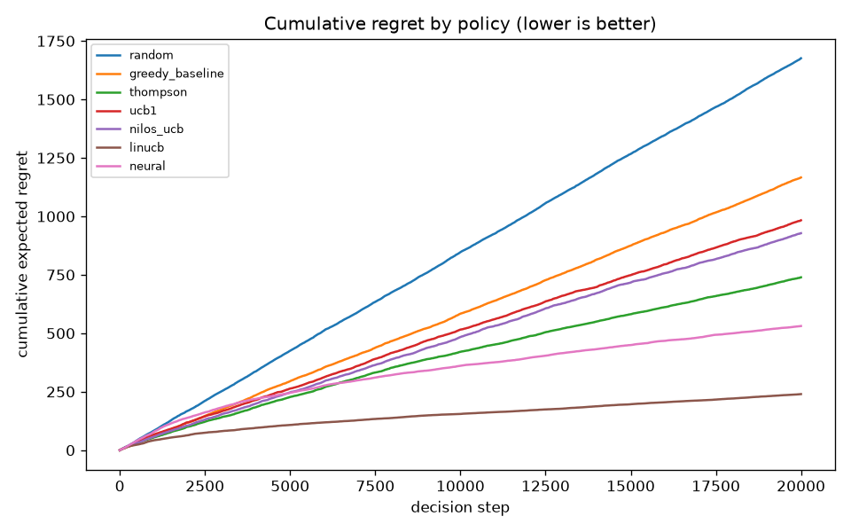

# Bandit policy comparison (Stage 3)

_Generated on 2026-06-20 by `aep bandits report`. 20,000 steps, delayed feedback, seed=123. Logged to MLflow._

## 1. Headline

- Lowest cumulative regret: **linucb** (regret 239.8, conversion 13.12%, 69.1% optimal actions).
- Deterministic baseline (`greedy_baseline`): regret 1166.4, conversion 8.61%, 26.9% optimal.
- The contextual policies (linucb, neural) use the client context to route each segment to its best arm, which a context-free policy cannot do — see `% optimal`.

## 2. Metrics (all policies)

| Policy | Contextual | Conversion | Cum. reward | Cum. regret | % optimal | Exploration (entropy) |
|--------|:---------:|-----------:|------------:|------------:|----------:|----------------------:|
| `random` | — | 6.17% | 1235 | 1676.2 | 13.9% | 0.980 |
| `greedy_baseline` | — | 8.61% | 1722 | 1166.4 | 26.9% | 0.009 |
| `thompson` | — | 10.61% | 2121 | 739.3 | 41.8% | 0.636 |
| `ucb1` | — | 9.45% | 1889 | 983.1 | 34.5% | 0.899 |
| `nilos_ucb` | — | 9.74% | 1947 | 928.1 | 35.7% | 0.864 |
| `linucb` | yes | 13.12% | 2625 | 239.8 | 69.1% | 0.913 |
| `neural` | yes | 11.71% | 2342 | 531.0 | 51.5% | 0.904 |

Exploration entropy is the normalized entropy of the arm-selection distribution (0 = always one arm, 1 = uniform). `random` sits near 1; the baseline collapses to one arm; adaptive policies sit in between.

## 3. Nilos-UCB confidence x exploration x conversion trade-off

Sweeping the confidence coefficient `c` (index = mean + c·sqrt(ln t / n)):

| c | Conversion | Cum. regret | % optimal | Exploration (entropy) |
|---|-----------:|------------:|----------:|----------------------:|
| 0.1 | 10.27% | 791.0 | 38.9% | 0.547 |
| 0.5 | 10.25% | 793.4 | 40.5% | 0.707 |
| 1.0 | 9.74% | 928.1 | 35.7% | 0.864 |
| 2.0 | 9.09% | 1050.0 | 32.7% | 0.922 |
| 4.0 | 8.36% | 1204.4 | 28.2% | 0.965 |

Small `c` exploits early (good short-term conversion, but risks locking onto a sub-optimal arm); large `c` explores more (higher entropy, better long-run optimality). This is the confidence/exploration knob the banca asks us to analyze for the UCB family.

## 4. Cold-start handling

- **Thompson:** uninformative Beta(1,1) priors — unplayed arms are sampled fairly from the prior, so early picks are exploratory by construction.
- **UCB1 / Nilos-UCB:** unplayed arms get an infinite index, forcing one pull of every eligible arm before exploitation.
- **Greedy baseline:** explicit one-pull-per-arm warm-up, then commit.
- **LinUCB:** ridge prior (A = I) gives a large initial confidence bonus that shrinks as evidence accrues.
- **Neural:** epsilon starts near 1 and the net is untrained until the replay buffer fills, so it behaves like `random` during cold-start.

## 5. Delayed-reward handling

The simulator delivers each reward `1 + Poisson(lambda_product)` steps after the decision (a non-trivial delay for slow-settling products like investment/premium). Policies therefore act on **stale statistics** and must keep exploring until feedback arrives — this is why purely greedy exploitation is penalized and uncertainty-aware policies (Thompson, UCB, LinUCB) are more robust. Rewards still pending after the last step are flushed so no feedback is lost.

## 6. Reproducibility

All policies see the **same** environment stream and common-random-number reward draws (variance reduction). Seeds are fixed; every policy is a separate MLflow run under the configured experiment with its hyper-parameters and metrics.

